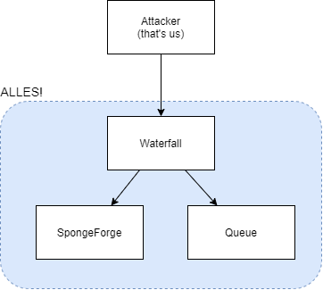
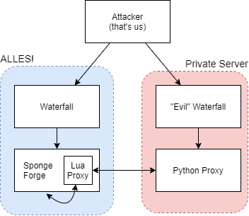

# ALLES!Craft
**Catagory:** Game Pwn  
**Difficulty:** Hard
> JOIN MY NEW COOL MINECRAFT SERVER, PLS NO HAX :)

## Challenge Setup
The challenge server consists of a Waterfall proxy, which is connected to a server running SpongeForge server. The only installed mod on the server is the [OpenComputers](https://github.com/MightyPirates/OpenComputers) mod.  
  
The Waterfall proxy is also connected to a Queue server. When we first connect to the proxy, moved to the queue server. After completing a simple parkour challenge (flyhacks ftw), we are moved to a SpongeForge server.  
Each SpongeForge server allows one player to connect at a time.


  
We are provided with all required files to setup a local server. This also includes source code for a custom "flag" plugin that runs on the SpongeForge server.

## Poking at the plugin
The plugins code is fairly straigth forward; A new command is registered that simply returns the flag. The only catch is that you need "\*" (operator) permissions to use it.  
```java
TODO java goes here
```
Furthermore, the plugin also hints that it is possible for admins to join the SpongeForge server, more on this later.
```java
TODO more java here
```

## The server files
The provided server files allow us to examine the setup of the servers. The Proxy and Queue servers are also included, but all of the interesting stuff is in the SpongeForge settings.  
  
### Sponge Server Properties
The `server.properties` file reveals that the server is running on port `31337`. It also shows that the server is running in offline mode, and will trust any upstream proxy to handle authentication. I'll go into more detail later, but in a nutshell; you should **never** be allowed to connect to Forge directly, since it doesn't perform any authentication. This is ensured by disallowing any remote connections directly to the Forge server.  

Finally, the `ops.json` file contains the following:
```json
json goes here
TODO
```

## But what about this computer thingy?
The server only has a single mod installed, so it's probably important somehow. After joining the server, we find ourselfs on a small island, with a computer setup on the shore. When examining the computer, I noticed that it contains an "internet card"
TODO, Link to internet card?
The internet component supports both raw TCP sockets, and HTTP requests. The catch here is that these TCP sockets will originate **from** the SpongeForge server, and thus will not be shot down by the firewall rules. Furthermore, it is also able to connect to any IP on the internet.

## Putting it all together
Now that we have a way to create a TCP proxy from inside the SpongeForce server, we have all required parts to complete the challenge.  

### Final goal
Let's start by giving a quick overview of the game plan here. We want to setup a TCP session through an OpenComputer program. We will need 3 pieces of software to realise this goal:  
* An proxy written in Lua
* A "middleware" proxy (written in Python)
* An "Evil" Waterfall proxy, to handle auth.
  


### Lua
### Python
### Waterfall Patch

## Flag time

